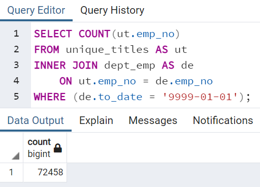
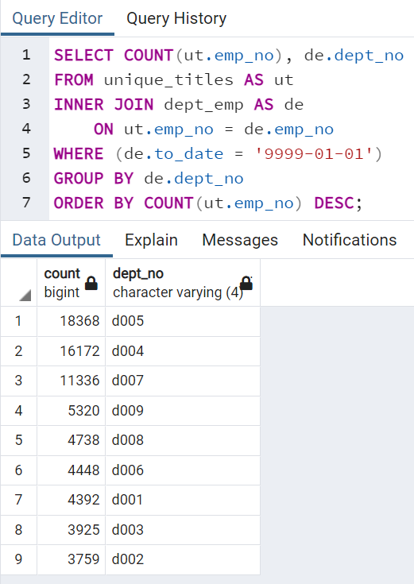
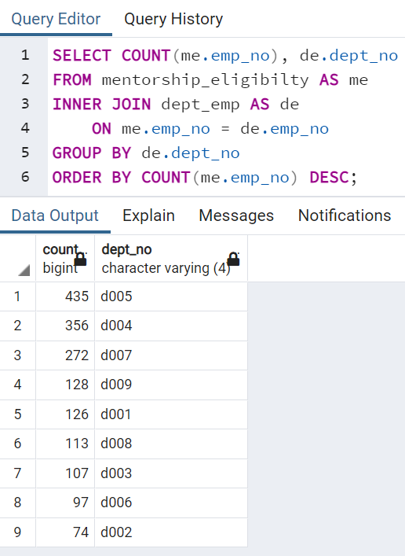

# Pewlett Hackard Analysis

## Overview of Project

### Purpose

Pewlett Hackard has many employees reaching retirement age and is trying to prepare for all the upcoming job vacancies. They would like to know the number of retiring employees by title, as well as the employees that are eligible for a mentorship program they plan to start. I will be using SQL to query the data and analyze the future impact to the company.

## Results

### Major Points from the Analysis

- As seen in the [retirement titles data](Data/retirement_titles.csv), there are duplicate entries for many of the employees because they have been with the company long enough to change titles and get promoted over the years, so they have a lot of institutional knowledge.
- Based on the number of rows in the [unique titles data](Data/unique_titles.csv), there are 90,398 employees that will be retiring in the near future.
- The retiring titles table below shows that many employees have a senior position as their most recent job title.

- Based on the number of rows in the [mentorship eligibility data](Data/mentorship_eligibilty.csv), there are only 1,549 employees that are eligible to participate in the mentorship program.

## Summary

### Number of Roles to be Filled

As the "silver tsunami" begins to make an impact, there are 72,458 roles of current employees that will need to be filled.

All of the departments will be affected, but a few departments will be impacted more significantly than others. The Development, Production, and Sales departments currently have the most employees that will be retiring soon.

### Number of Qualified Mentors

There are not enough qualified employees in the departments to mentor the next generation. While there are mentorship eligible employees in all the departments, there are not enough to have a meaningful impact based on the number of positions that will need to be filled. The company should consider changing its mentorship eligibility requirements to increase the number of employees.

